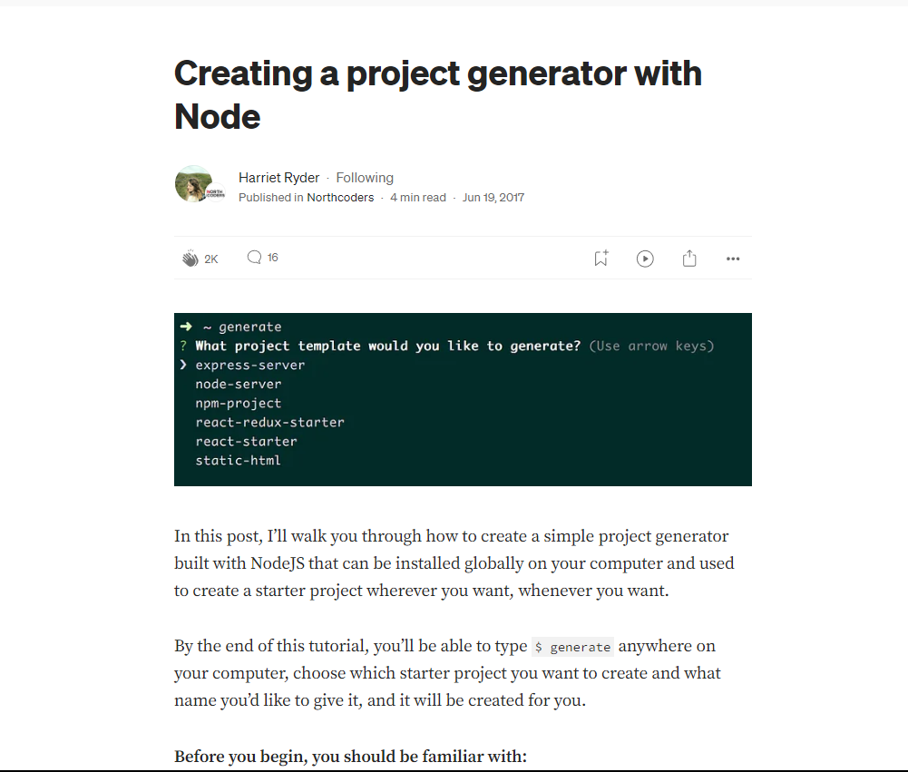

# @s54a/init

I built this project cause I was creating templates while starting a new project & I thought there must be a better way to do this

## Folder Structure

    📁 init
    ├── 🌅 images
    │   ├── 🖼️ article.png
    │   ├── 🖼️ init -a.png
    │   ├── 🖼️ init -c.png
    │   ├── 🖼️ init -h.png
    │   ├── 🖼️ init -r.png
    │   └── 🖼️ init.png
    ├── 📁 templates
    │   └── 📁 templateTest
    │       ├── 📄 index.html
    │       ├── 📄 main.js
    │       └── 📄 style.css
    ├── 📄 .gitignore
    ├── 📄 .npmignore
    ├── 📄 index.js
    ├── 📜 LICENSE
    ├── 📝 Readme.md
    ├── 📋 package.json
    └── 📋 package-lock.json

For testing purposes, only one template has been included, consisting of three files _(HTML, CSS & JS)_. Additional templates have not been added to avoid making the package unnecessarily large.

_(Note ChatGPT built this folder structure)_

## How it Works

To begin, open a terminal at the desired project location and run this command

```bash
init
```

This displays all available templates from the template folder, listed by folder name. Choose a template and enter the desired folder name when prompted to create a new project with the selected template's contents.

**Users can also create templates themselves by running:**

```bash
init -a "C:\Users\{User}\Desktop\Projects\Ongoing Projects"
```

Upon execution, the tool generates a new folder path containing the contents of the user-created template. Subsequently, when the init command is invoked, it showcases the recently created template under the specified name.

_Tip_: For Windows users, you can quickly access the folder by selecting it and then pressing `ctrl + shift + c`.

**Templates can be removed using the following command:**

```bash
init -r "template name"
```

_(Note: The name must match exactly.)_

**Templates can also be added from GitHub with:**

```bash
init -c "https://github.com/user/repoitoryName"
```

This process involves cloning the repository into the current terminal directory, removing the .git folder from the cloned repository, executing the init -a "repoName" command to create a copy in the templates folder, and then deleting the cloned repository folder from the current terminal location.

The reason it performs all these steps is because I attempted to accomplish it in a simpler manner but couldn't find one.

## Resources

#### These are the YouTube Videos & Article which helped me build this

[](https://medium.com/northcoders/creating-a-project-generator-with-node-29e13b3cd309)

[](https://www.youtube.com/watch?v=xYko2bHNgVA)

[](https://www.youtube.com/watch?v=UxdSoefSxrA)

& ChatGPT

This a similer project built with Typescript
https://github.com/pongsatt/mycli/blob/master/src/index.ts

Extra Resources
https://github.com/lirantal/nodejs-cli-apps-best-practices

Take a look at https://yeoman.io/generators/
