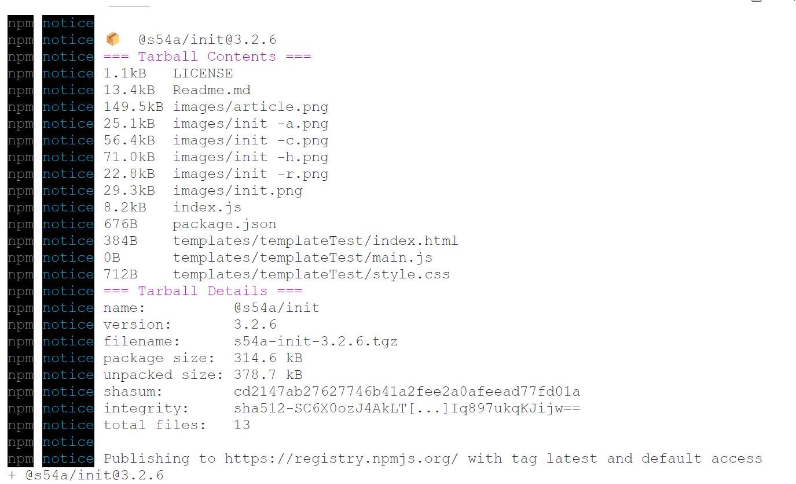
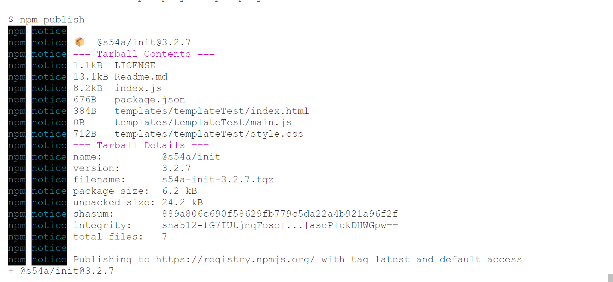

<!-- START doctoc generated TOC please keep comment here to allow auto update -->
<!-- DON'T EDIT THIS SECTION, INSTEAD RE-RUN doctoc TO UPDATE -->

**Table of Contents** _generated with [DocToc](https://github.com/thlorenz/doctoc)_

- [@s54a/init || TempLate CLI || Project Initializer](#s54ainit--template-cli--project-initializer)
  - [How it Works](#how-it-works)
  - [Video Tutorial](#video-tutorial)
  - [Folder Structure](#folder-structure)
  - [Installation](#installation)
  - [Usage](#usage)
  - [Resources](#resources)
    - [These are the YouTube Videos & Article which helped me build this](#these-are-the-youtube-videos--article-which-helped-me-build-this)
  - [Read this if you are a beginner](#read-this-if-you-are-a-beginner)
  - [Why I Created this](#why-i-created-this)
  - [How I use this Package](#how-i-use-this-package)
  - [Extra Info](#extra-info)
  - [Source Code](#source-code)
    - [index.js](#indexjs)
    - [package.json](#packagejson)

<!-- END doctoc generated TOC please keep comment here to allow auto update -->

# @s54a/init || TempLate CLI || Project Initializer

When I was starting a new project, I used the 'create vite app' command. Then, I began to remove and add files for the project. It struck me that I could create it once and paste it everywhere when I start a new project. Thats how I started building this.

_There are two branch of this project in this one I have removed images & a few files to reduce the size_

_Visit the Github Readme to see examples_

## How it Works

The package stores Templates inside a folder called "Templates" then when you run the `init` command it displays the templates and then it will paste the folder at the location where the terminal is open.

_Simply it just copies & pastes the Folders from one place to another_

## Video Tutorial

[](https://www.youtube.com/watch?v=fmWuOmyIZLc)

## Folder Structure

    📁 init
    ├── 📁 templates
    │   └── 📁 templateTest
    │       ├── 📄 index.html
    │       ├── 📄 main.js
    │       └── 📄 style.css
    ├── 📄 index.js
    ├── 📜 LICENSE
    ├── 📝 Readme.md
    └── 📋 package.json

For testing purposes, only one template has been included, consisting of three files _(HTML, CSS & JS)_. Additional templates have not been added to avoid making the package unnecessarily large.

_(Note ChatGPT built this folder structure)_

## Installation

This package provides an Executable Command

You will have to install this package globally to be able to use the `init` command.

```bash
npm install -g @s54a/init
```

## Usage

To begin, open a terminal at the desired project location and run this command

```bash
init
```

This displays all available templates from the template folder, listed by folder name. Choose a template and enter the desired folder name when prompted to create a new project with the selected template's contents.

**Users can also create templates themselves by running:**

```bash
init -a "C:\Users\{User}\Desktop\Projects\Ongoing Projects"
```

Upon execution, the tool generates a new folder path containing the contents of the user-created template. Subsequently, when the init command is invoked, it showcases the recently created template under the specified name.

_Tip_: For Windows users, you can quickly access the folder by selecting it and then pressing `ctrl + shift + c`.

**By Default when you create a Template it skips the `node_modules` folder and its contents.**

_But for reason you want to create a template with `node_modules` folder you will have to pass the `-y` flag._

```bash
init -a "O:\test\cliTest" -y
```

**Templates can be removed using the following command:**

```bash
init -r "template name"
```

_(Note: The name must match exactly.)_

**Templates can also be added from GitHub with:**

```bash
init -c "https://github.com/user/repoitoryName.git"
```

This process involves cloning the repository into the current terminal directory, removing the .git folder from the cloned repository, executing the init -a "repoName" command to create a copy in the templates folder, and then deleting the cloned repository folder from the current terminal location.

I have used this Regex to verify if the given string is a link or not.

```js
const urlRegex =
  /^(https?|ftp):\/\/(([a-z\d]([a-z\d-]*[a-z\d])?\.)+[a-z]{2,}|localhost)(\/[-a-z\d%_.~+]*)*(\?[;&a-z\d%_.~+=-]*)?(\#[-a-z\d_]*)?$/i;
```

The reason it performs all these steps is because I attempted to accomplish it in a simpler manner but couldn't find one.

**To see all the Commands (Help)**

```bash
init -h
```

## Resources

#### These are the YouTube Videos & Article which helped me build this

[Harriet Ryder's The Article Link](https://medium.com/northcoders/creating-a-project-generator-with-node-29e13b3cd309)

[](https://www.youtube.com/watch?v=xYko2bHNgVA)

[](https://www.youtube.com/watch?v=UxdSoefSxrA)

& ChatGPT

This a similar project built with Typescript
https://github.com/pongsatt/mycli/blob/master/src/index.ts

Extra Resources
https://github.com/lirantal/nodejs-cli-apps-best-practices

Take a look at https://yeoman.io/generators/

## Read this if you are a beginner

I asked one of my friend who is a beginner in Web Dev. She asked me a question how will I make templates or why use this instead of **Copy Pasting**

So when ever you do

```bash
npm create-react-app ProjectName
```

or

```bash
npm create-vite-app ProjectName
```

These files are generated (with create react app)

    my-app/
    ├── README.md
    ├── node_modules/
    ├── package.json
    ├── .gitignore
    ├── public/
    │   ├── favicon.ico
    │   ├── index.html
    │   ├── manifest.json
    │   └── robots.txt
    └── src/
    ├── App.css
    ├── App.js
    ├── App.test.js
    ├── index.css
    ├── index.js
    └── logo.svg

As you can see there are so many files which aren't necessary so you will have to remove these files remove code from `index.css` or maybe more files.

So you can do this once and use this template by using this package or just copy paste.

**So why use this package instead of copy pasting**
So assume you have created many templates now you will create a folder to store them and every time you will start a new project you will have to go to that location copy that file and paste it at the location where you are starting the project and then change the name.

So this package does all that when you create a template and add it as a template from Command Line Interface and what I have learned & heard is **that you will much faster at things with CLI then GUI**.

## Why I Created this

When you start Learning to code you will create multiple new projects so every time you will have to create new files

e.g. index.html, style.css, app.js

When you will advance to React you will do

So every time you will do that you will have to remove files edit content of the files.

So I thought it is a hassle so lets just do it once and I wil copy & paste it every time whenever I start a new project.

Then I thought I can create a cli which does that for me & I started building this package.

Then on a suggestion of a friend I also added the Clone & Create Template from Github Feature.

## How I use this Package

I use this Package whenever I start a new project.

I have created my own template and added them as templates using `init -a "folder path"` command.

I have also added templates on Github.

So if I am on a new device or format my current one so I can just run the `init -c "github_url"` command after installing the package to clone new project and create a new template.

So if you are a Freelancer or Someone who is learning to code, or starting a new Project you can use this.

## Extra Info

While Deploying Packages on NPM I realized that whatever you have in your project will get included even if you use npm ignore.
I don't know if npm ignore works or failed.
So I created another branch of this project in which I removed images and extra files.
To reduce the size of the package & the node_modules size.

Here is the difference




**So the Package Size is reduced by 300 Kilo Bytes**

## Source Code

Every time when I look at the open source I feel it is a hassle to navigate around files to see the code.

And this project source code is in a single file.

So I am adding the source code in the markdown file so you can read it all in one place.

### index.js

```js
#!/usr/bin/env node

import inquirer from "inquirer";
import fs from "fs";
import path from "path";
import { fileURLToPath } from "url";
import { execSync } from "child_process";
import chalk from "chalk";

const __dirname = path.dirname(fileURLToPath(import.meta.url));
const CHOICES = fs.readdirSync(path.join(__dirname, "templates"));

const QUESTIONS = [
  {
    name: "project-choice",
    type: "list",
    message: "What project template would you like to generate?",
    choices: CHOICES,
  },
  {
    name: "project-name",
    type: "input",
    message: "Project name:",
    validate: function (input) {
      if (/^([A-Za-z\-\_\d])+$/.test(input)) return true;
      else
        return "Project name may only include letters, numbers, underscores and hashes.";
    },
  },
];

const CURR_DIR = process.cwd();

let nodeFlag = false; // Set nodeFlag as a global variable with a default value of false

// Command line arguments
const [, , condition, folderPath, nodeFlagParam] = process.argv;

const [, , ...args] = process.argv;

const options = {
  condition: null,
  folderPathOrNameOrLink: null,
  nodeFlagParam: "",
};

// Parse command line arguments
for (let i = 0; i < args.length; i++) {
  const arg = args[i];
  switch (arg) {
    case "-a":
    case "-r":
    case "-c":
      options.condition = arg;
      break;
    case "-h":
      options.condition = arg;
      options.folderPathOrNameOrLink = "";
      break;
    case "-y":
      // Check if the previous option was '-a'
      if (options.condition === "-a") {
        options.nodeFlagParam = arg;
      } else {
        console.error(`Invalid usage of '-y' flag.`);
        process.exit(1);
      }
      break;
    default:
      if (arg.startsWith("-")) {
        console.error(`Invalid option: ${arg}`);
        process.exit(1);
      } else {
        options.folderPathOrNameOrLink = arg;
      }
      break;
  }
}

if (!args.length) {
  options.condition = "";
  options.folderPathOrNameOrLink = "";
}

// Check for unsupported or invalid options
if (Object.values(options).some((value) => value === null)) {
  console.error(`Missing required option or invalid usage.`);
  process.exit(1);
}

// Update the value of nodeFlag based on the command line argument
if (nodeFlagParam === "-y") {
  nodeFlag = true;
}

function createDirectoryContents(templatePath, newProjectPath) {
  const filesToCreate = fs.readdirSync(templatePath);

  filesToCreate.forEach((file) => {
    const origFilePath = path.join(templatePath, file);

    // get stats about the current file
    const stats = fs.statSync(origFilePath);

    if (stats.isFile()) {
      const contents = fs.readFileSync(origFilePath, "utf8");

      // Rename
      if (file === ".npmignore") file = ".gitignore";

      if (condition === "-a") {
        fs.writeFileSync(
          path.join(__dirname, "templates", newProjectPath, file),
          contents,
          "utf8"
        );
      } else {
        fs.writeFileSync(
          path.join(CURR_DIR, newProjectPath, file),
          contents,
          "utf8"
        );
      }
    } else if (stats.isDirectory()) {
      if (condition === "-a") {
        if (file === "node_modules" && !nodeFlag) {
          return;
        } else {
          fs.mkdirSync(path.join(__dirname, "templates", newProjectPath, file));
        }
      } else {
        fs.mkdirSync(path.join(CURR_DIR, newProjectPath, file));
      }

      // Then recursively copy contents
      createDirectoryContents(
        path.join(templatePath, file),
        path.join(newProjectPath, file)
      );
    }
  });
}

if (!condition) {
  inquirer.prompt(QUESTIONS).then((answers) => {
    const projectChoice = answers["project-choice"];
    const projectName = answers["project-name"];
    const templatePath = path.join(__dirname, "templates", projectChoice);
    const projectPath = path.join(CURR_DIR, projectName);

    // Create project directory if it doesn't exist
    if (!fs.existsSync(projectPath)) {
      fs.mkdirSync(projectPath);
    } else {
      console.log(`\nProject directory '${projectName}' already exists.`);
      {
        process.exit(1);
      }
    }

    createDirectoryContents(templatePath, projectName);
    console.log("\nTemplate successfully created.");
  });
} else if (condition === "-a") {
  // Validate folder path
  if (!folderPath) {
    console.error("\nError: provide a folder path.");
    {
      process.exit(1);
    }
  }

  // Validate folder existence
  if (!fs.existsSync(folderPath)) {
    console.error("\nError: Folder does not exist.");
    {
      process.exit(1);
    }
  }

  // Create project name from folder path
  const projectName = path.basename(folderPath);

  // Create directory for new project if it doesn't exist
  const templateFolderPath = path.join(__dirname, "templates", projectName);
  if (!fs.existsSync(templateFolderPath)) {
    fs.mkdirSync(templateFolderPath);
  } else {
    console.log(`\nFolder '${templateFolderPath}' already exists.`);
    {
      process.exit(1);
    }
  }

  // Copy contents from folderPath to projectName/template
  createDirectoryContents(folderPath, projectName);

  // InformSync user about successful operation
  if (nodeFlag) {
    console.log("\nTemplate successfully created with node_modules.");
  } else {
    console.log("\nTemplate successfully created.");
  }
} else if (condition === "-r") {
  const templateToRemove = process.argv[3];

  // Validate if the template exists
  const templatePathToRemove = path.join(
    __dirname,
    "templates",
    templateToRemove
  );
  if (!fs.existsSync(templatePathToRemove)) {
    console.error(`\nError: Template '${templateToRemove}' does not exist.`);
    {
      process.exit(1);
    }
  }

  // Remove the template directory
  fs.rmSync(templatePathToRemove, { recursive: true });

  // InformSync user about successful operation
  console.log(`\nTemplate '${templateToRemove}' was successfully removed.`);
} else if (condition === "-c") {
  const runCommand = (command) => {
    return new Promise((resolve, reject) => {
      try {
        execSync(command, { stdio: "inherit" });
        resolve(); // Resolve the promise when the command completes successfully
      } catch (error) {
        console.error(`Failed to Execute ${command}`, error);
        reject(error); // Reject the promise with the error if the command fails
      }
    });
  };

  const urlRegex =
    /^(https?|ftp):\/\/(([a-z\d]([a-z\d-]*[a-z\d])?\.)+[a-z]{2,}|localhost)(\/[-a-z\d%_.~+]*)*(\?[;&a-z\d%_.~+=-]*)?(\#[-a-z\d_]*)?$/i;

  const repoLink = process.argv[3];

  if (!urlRegex.test(repoLink)) {
    console.log("Invalid repository link provided.");
    process.exit(1);
  } else {
    console.log("Repository link is valid.");
  }
  const gitCommand = `git clone --depth 1 ${repoLink}`;
  let projectName;

  // Check if a changed name is provided in the clone command
  if (repoLink.includes(" ")) {
    // Extract the project name from the clone command
    const cloneCommandParts = repoLink.split(" "); // Split the clone command by whitespace
    projectName = cloneCommandParts[cloneCommandParts.length - 1]; // Get the last part as the project name
  } else {
    // Extract the project name from the repository link
    projectName = path.basename(repoLink, ".git");
  }

  runCommand(gitCommand)
    .then(async () => {
      console.log("\nRepository Cloned");

      // Remove the .git folder
      const clonedFolderPath = path.join(CURR_DIR, projectName);
      const gitFolderPath = path.join(clonedFolderPath, ".git");
      if (fs.existsSync(gitFolderPath)) {
        await fs.promises.rm(gitFolderPath, { recursive: true });
      }

      // Run the 'init -a' command with the cloned folder path
      const initCommand = `init -a "${clonedFolderPath}"`;
      await runCommand(initCommand);

      // Remove the cloned project folder asynchronously
      try {
        await fs.promises.rm(clonedFolderPath, { recursive: true });
      } catch (error) {
        console.error(`Failed to remove cloned folder: ${error}`);
      }
    })
    .catch((error) => {
      console.error("Error cloning repository:", error);
      process.exit(1); // Exit the script with an error status code
    });
} else if (condition === "-h") {
  // Clear the terminal by printing ANSI escape codes
  process.stdout.write("\u001b[2J\u001b[0;0H");

  const message = `
${chalk.bold.underline.white("Package Commands:")}

    ${chalk.green("Create a New Template:")}
      - Type ${chalk.cyan("'init'")} and press Enter at your desired location.

    ${chalk.green("Add a Template:")}
      - Use the ${chalk.cyan(
        "-a"
      )} flag followed by the path in quotes. By default it skips the node_modules folder.
      ${chalk.yellow("Example:")} ${chalk.cyan("init -a")} ${chalk.yellow(
    '"C:\\Users\\{User}\\Desktop\\Projects\\Ongoing Projects"'
  )}
      - But if you want to add node_modules folder with the template you are creating then ${chalk.cyan(
        "-y"
      )} flag after the command.
      ${chalk.yellow("Example:")} ${chalk.cyan("init -a")} ${chalk.yellow(
    '"C:\\Users\\{User}\\Desktop\\Projects\\Ongoing Projects"'
  )} ${chalk.cyan("-y")}

    ${chalk.green("Clone a Repository and Add as a Template:")}
      - Use the ${chalk.cyan(
        "-c"
      )} flag followed by the repository link in quotes.
      ${chalk.yellow("Example:")} ${chalk.cyan("init -c")} ${chalk.yellow(
    '"https://github.com/user/repoitoryName"'
  )}

    ${chalk.green("Remove a Template:")}
    - Use the ${chalk.cyan(
      "-r"
    )} flag followed by the exact name of the template in quotes.
      ${chalk.yellow("Example:")} ${chalk.cyan("init -r")} ${chalk.yellow(
    '"Template Name"'
  )}
        
    ${chalk.green("Help:")}
    - Use ${chalk.cyan("init -h")} to see help.


    Made By Sooraj Gupta
    Email : soorajgupta00@gmail.com
    Github Repository : https://github.com/s54a/s54a-init

`;

  console.log(message);
} else if (condition) {
  console.log(
    chalk.red(
      `
      Invalid command: "${condition}".
      
      Please use one of the supported commands.
      
      Run ${chalk.yellow("init -h")} to see help.
      
      `
    )
  );
} else {
  console.log(
    chalk.red(
      `An error occurred or an invalid command was provided.
      Run ${chalk.yellow("init -h")} to see help.`
    )
  );
}
```

### package.json

```json
{
  "name": "@s54a/init",
  "version": "5.0.0",
  "description": "Project Initializer",
  "main": "./index.js",
  "type": "module",
  "scripts": {
    "test": "echo \"Error: no test specified\" && exit 1"
  },
  "bin": {
    "init": "index.js"
  },
  "repository": {
    "type": "git",
    "url": "git+https://github.com/s54a/s54a-init.git"
  },
  "keywords": ["Project Initializer", "Initializer", "Init"],
  "author": "Sooraj Gupta",
  "license": "MIT",
  "dependencies": {
    "chalk": "^5.3.0",
    "inquirer": "^9.2.15"
  },
  "bugs": {
    "url": "https://github.com/s54a/s54a-init/issues"
  },
  "homepage": "https://github.com/s54a/s54a-init#readme"
}
```
